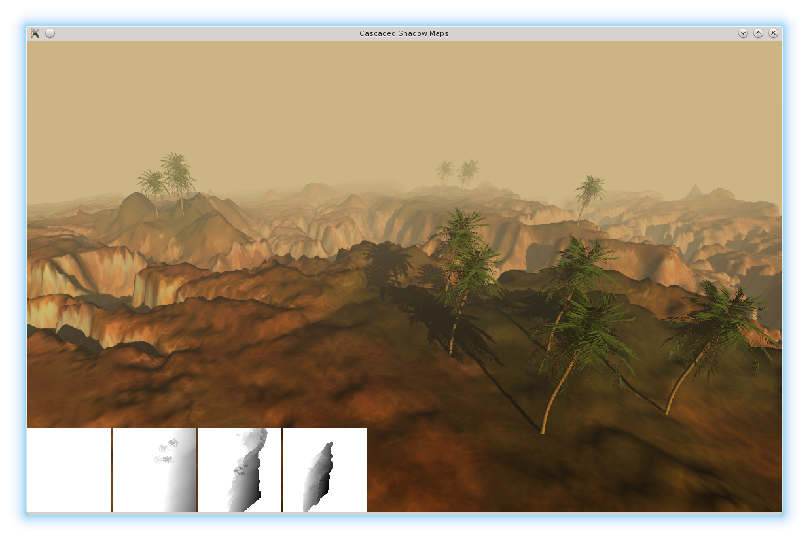
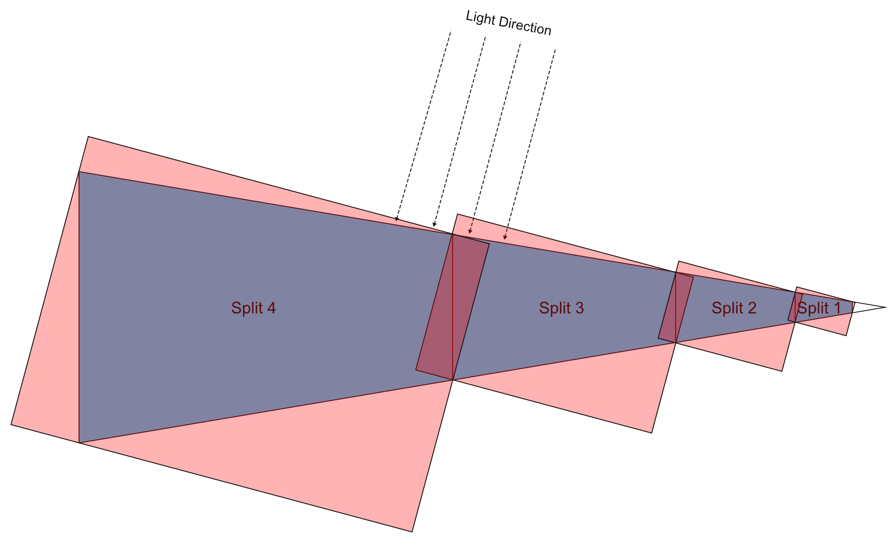

## Nvidia Cascaded Shadow Maps with shaders and GLM
Modification of the Nvidia Cascading Shadow Maps demo using a pure shader based approach over immediate mode. This project is useful for anyone interested in learning more about cascaded shadow mapping techniques.

In the lower left hand corner of the screenshot you can see the depth textures of the shadow map.

## What does it do and how does it work?
Shadow mapping is a technique where the scene is rendered to a depth texture from the point of view of a light source, and this depth texture is again sampled during normal scene rendering to create the illusion of shadows, or "non-lit" fragments. While rendering large scenes and using only one shadow map, the shadow map resolution will become an issue where the shadows become more pixelated as the view distance increases. In modern real-time graphics rendering this can be solved by using a technique called "Cascaded Shadow Mapping", where N shadow maps are rendered for each light source, each covering a larger area of the frustum the further away from the camera it is. 

Here we can see the camera frustum from above, and how the shadow map splits are distributed along the frustom (showing four splits)

Read more about (cascaded) shadow mapping here: https://en.wikipedia.org/wiki/Shadow_mapping

## Legal Disclamer
The original code was not written by me, and the original copyright notices have been kept in place where applicable.
The original whitepaper and code can be found here:
* http://developer.download.nvidia.com/SDK/10.5/opengl/screenshots/samples/cascaded_shadow_maps.html
* http://developer.download.nvidia.com/SDK/10.5/opengl/src/cascaded_shadow_maps/doc/cascaded_shadow_maps.pdf
* http://developer.download.nvidia.com/SDK/10.5/Samples/cascaded_shadow_maps.zip

## Dependencies
* GLUT (https://www.opengl.org/resources/libraries/glut/)
* libpng (http://www.libpng.org/pub/png/libpng.html)
* GLEW (http://glew.sourceforge.net/)
* gml (http://glm.g-truc.net/0.9.7/index.html)
 
## Building
The project uses CMake to generate build files for any platform (currently only tested on Linux and OS X). 

    cd NvidiaCascadedShadowMapsGLM
    mkdir build && cd build
    cmake -G "Unix Makefiles" .. # NOTE: Replace "Unix Makefiles" with your platform / build tool of choice
    make
    ./csm_demo_glm

